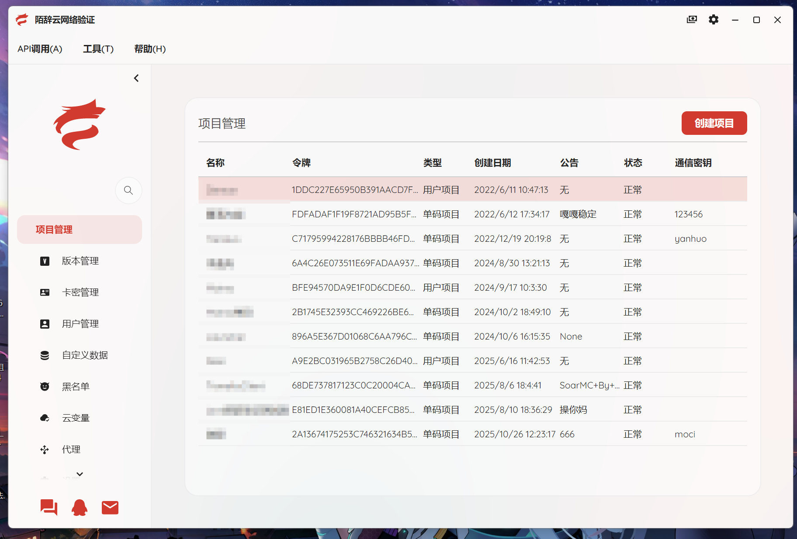
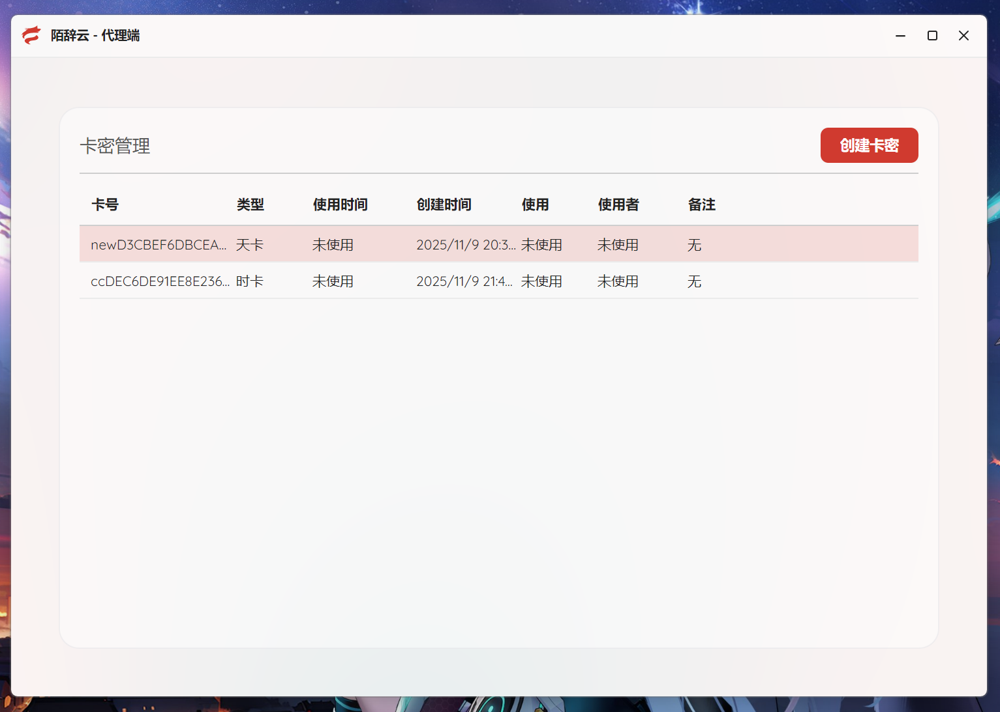

# 陌辞云网络验证
[](LICENSE)
[](https://dotnet.microsoft.com/)
[](https://avaloniaui.net/)
> 一个轻量级、安全的网络验证解决方案，支持软件授权、用户身份校验与用户状态管理。
>
> 该项目通过API与服务器通信并进行一系列操作，无服务端
>


- ## ✨ 核心功能

- 🔐 安全的 HTTP/HTTPS 验证通信
- 📋 支持用户名/密码、登录验证等多种验证方式
- 👤 可关联卡密与用户，实现登录态与权限管理，实时监控/控制用户状态
- ☁️  支持云变量，服务端动态下发配置，客户端实时获取，无需更新软件
- 🧩 易集成：提供 C#/Java/C++/易语言 等客户端 SDK，适用于多种语言开发
- 🛡️ 服务端防刷、限流、IP 黑名单等基础防护
- 📦 更多功能使用即知

## 🖼️ 软件截图




## 🚀 快速开始

### 先决条件

- [.NET 8 SDK](https://dotnet.microsoft.com/download/dotnet/8.0)
- （可选）JetBrains Rider 或 Visual Studio 2022+

### 克隆并构建运行
```bash
git clone https://github.com/TianQius/MoCiVerification.git
```
- 在IDE中编译后即可使用
### Release下载运行
- 📥 下载最新版本：[Releases](https://github.com/TianQius/MoCiVerification/releases)
## ⚠️ 安全建议
- 不要随意删减代码，避免无法编译或编译后无法正常使用

## 📄 许可证
- 本项目采用 [](LICENSE) —— 免费用于个人或商业项目（请标明来处）。
  
